# AWS IAM Mini Project

## Overview
This hands-on guide will equip you with the skills needed to set up AWS IAM users, groups, and roles. By following these exercises, you'll gain practical experience in implementing IAM solutions and managing access policies within AWS.

---

## Table of Contents

1. [Accessing IAM in AWS Console](#accessing-iam-in-aws-console)
2. [Creating an IAM Policy](#creating-an-iam-policy)
3. [Creating and Attaching Users](#creating-and-attaching-users)
4. [Managing User Groups](#managing-user-groups)
5. [Attaching Policies to Groups](#attaching-policies-to-groups)
6. [Summary](#summary)

---

## Accessing IAM in AWS Console

1. Log in to your AWS Console.
2. Navigate to **IAM**.

   

---

## Creating an IAM Policy

1. Select **Policies** from the IAM sidebar.
2. Click **Create policy** (top right).

   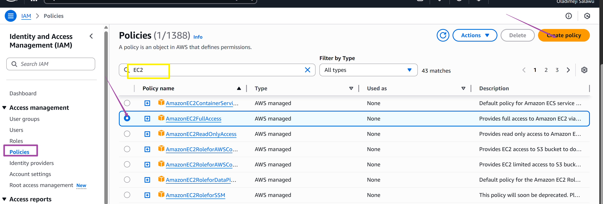

3. Under the **Service** section, choose **EC2**.
4. Check **All EC2 actions**.

   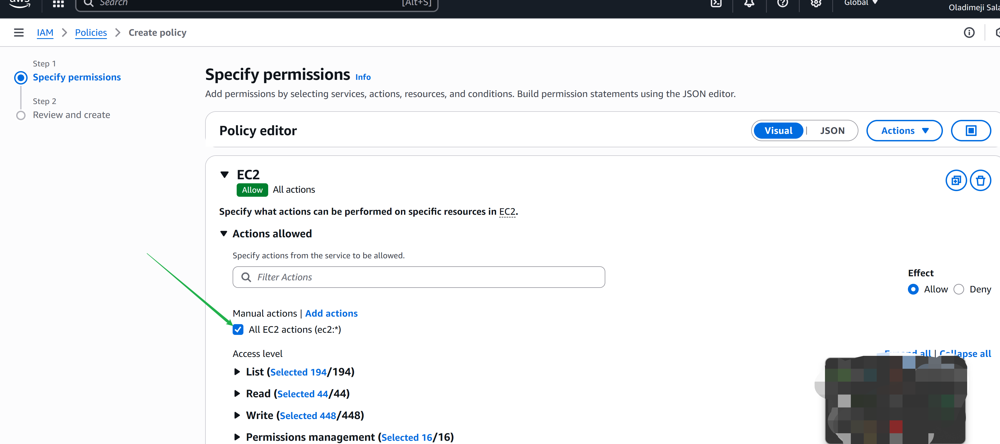
   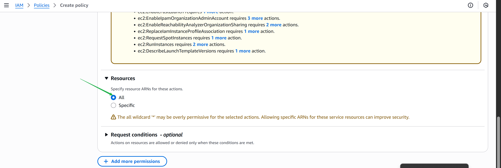
   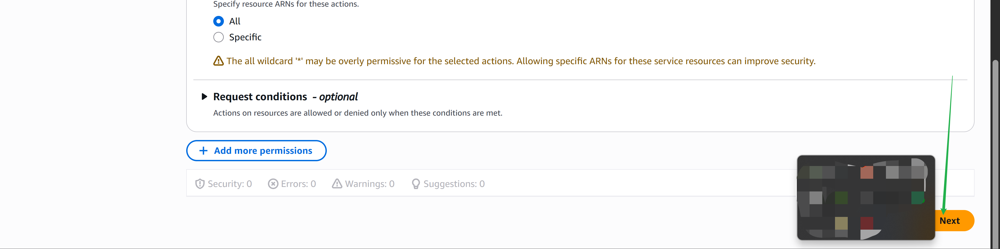

5. Name your policy (e.g., `policy_for_eric`) and finalize creation.

   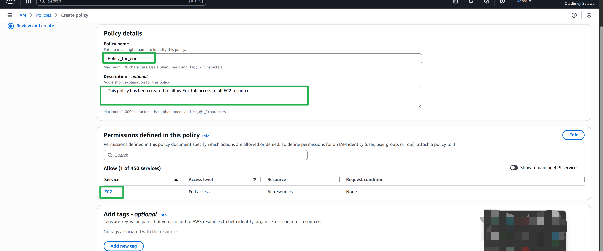
   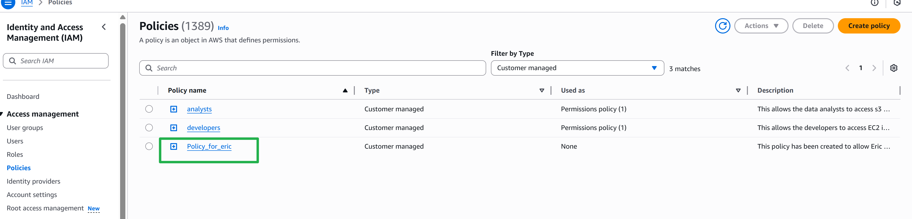

---

## Creating and Attaching Users

1. Select **Users** and click **Create user**.

   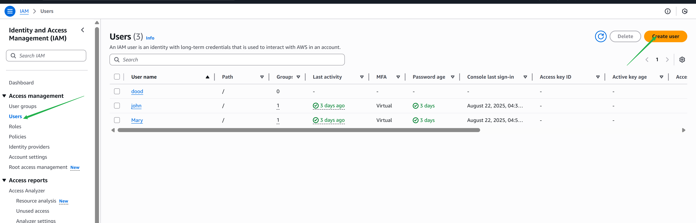
   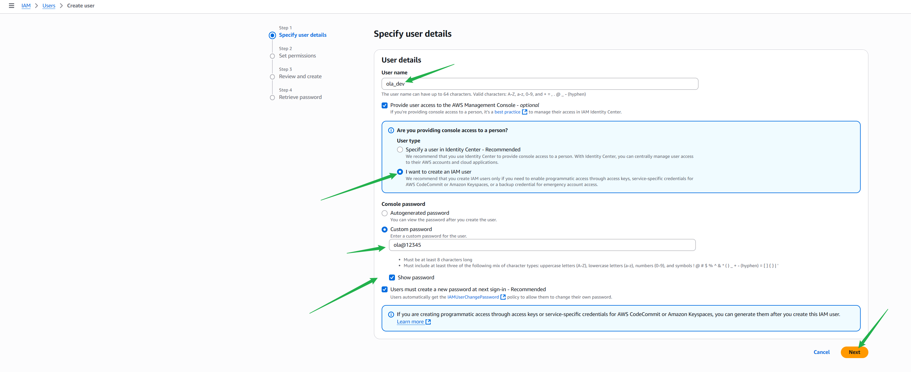

2. During setup, choose **Attach policies directly** and filter for custom policies.
3. Select the policy you just created (e.g., `policy_for_eric`) and proceed.

   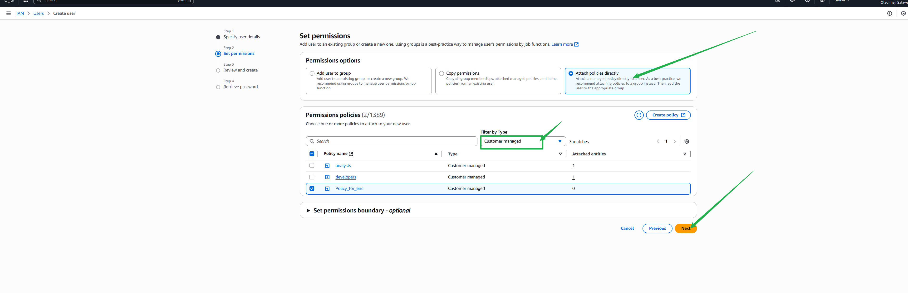
   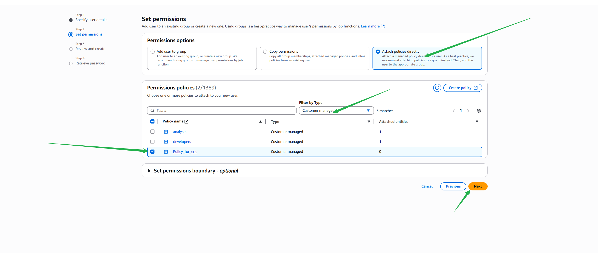

4. Save your changes for future reference.

---

## Managing User Groups

1. Return to the user list.

   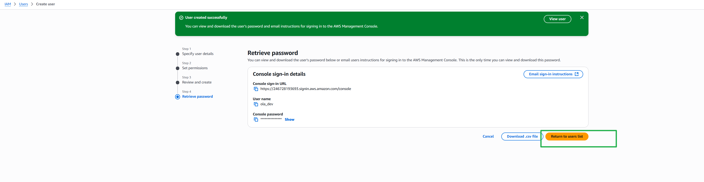
   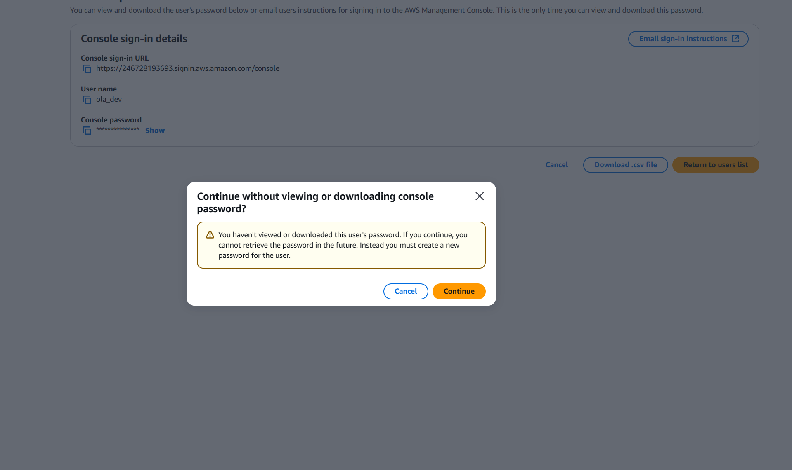

2. Click on **User groups**.

   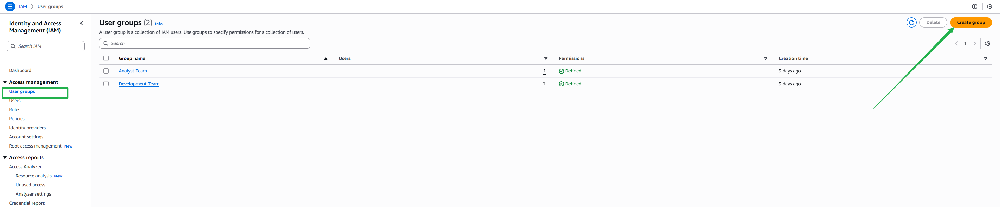
   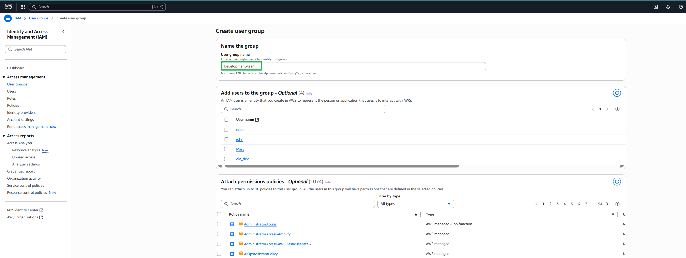

3. Select your user(s).

   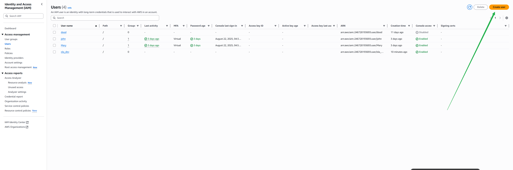
   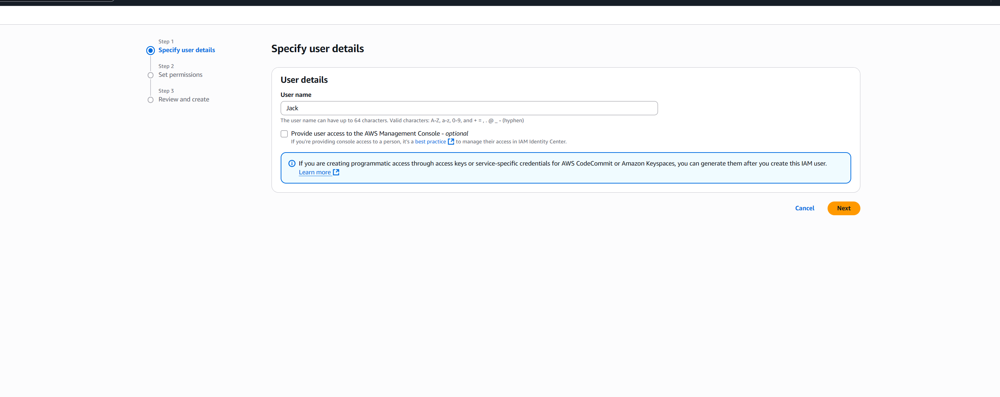

4. Add the user to a group and click **Next**.

   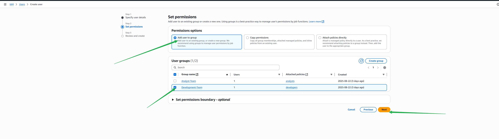
   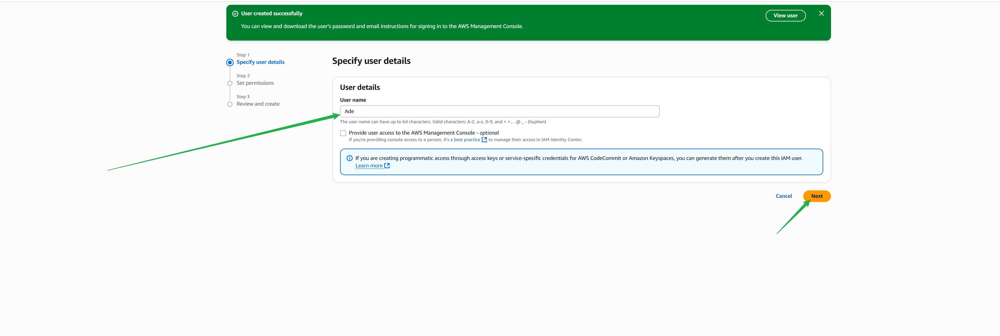
   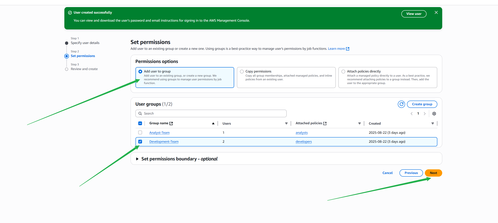
   

---

## Attaching Policies to Groups

1. Navigate to **Policies** and click **Create policy**.
2. Select **EC2** service and all actions.

   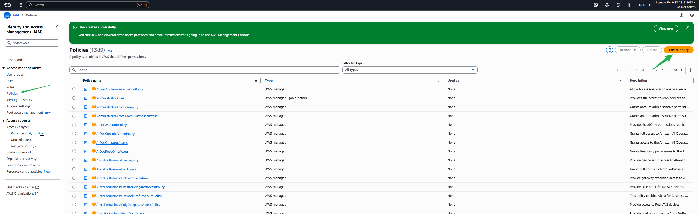
   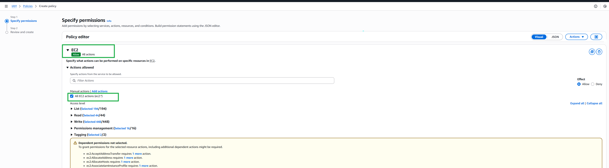

3. Click **Next** to proceed.

   
   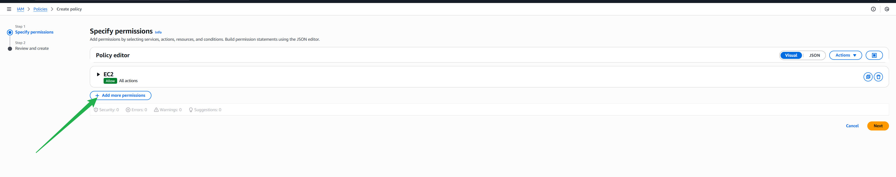

4. Expand and add S3 permissions, selecting **All actions**.

   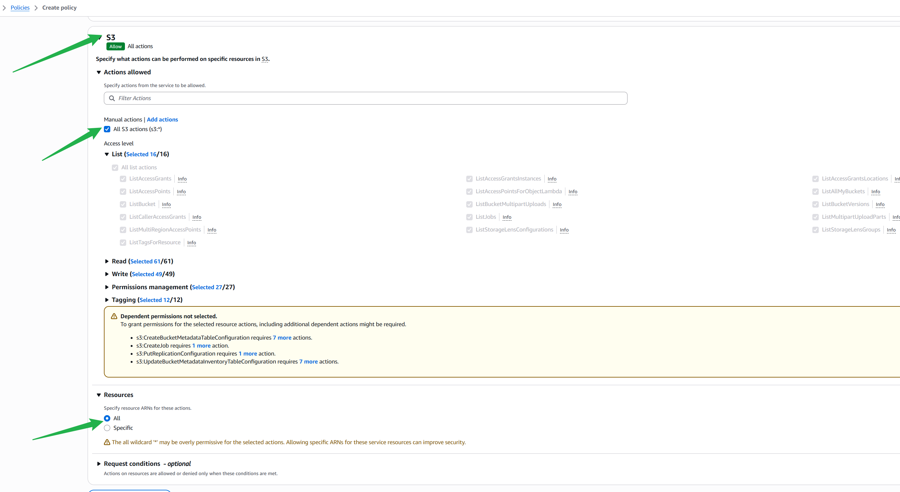
   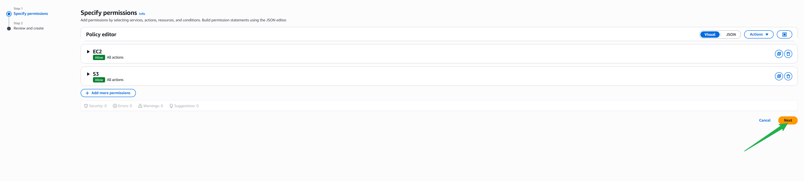

5. Click **Create policy**.

   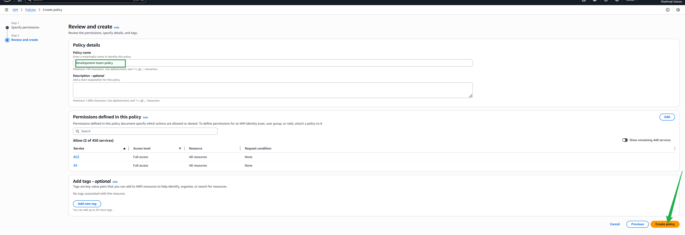

6. Go to **User Groups**, select the group (e.g., `Development-team`).

   

7. Under **Permissions**, grant the necessary permissions.

   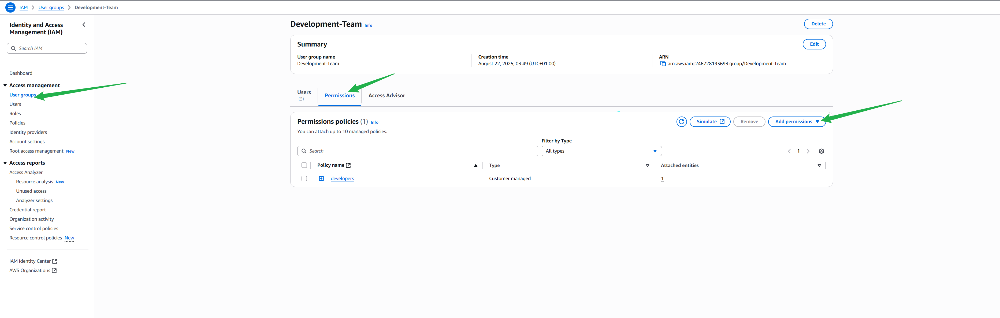
   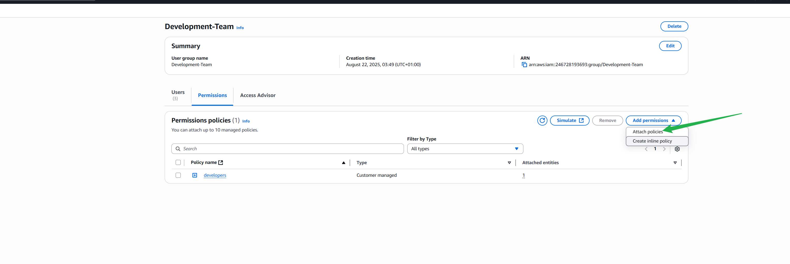
   

8. In **Customer managed policies**, choose the newly created policy (e.g., `Development-team-policy`) and attach it.

   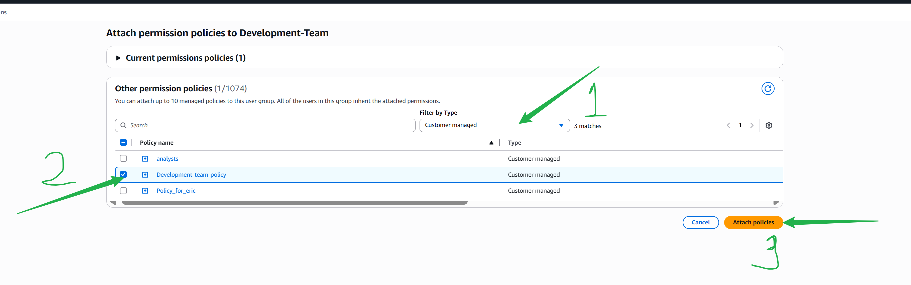

9. You have successfully attached the policy to the group!

   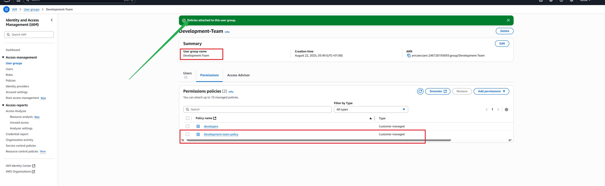

---

## Summary

By following the steps above, you have:
- Created custom IAM policies for EC2 and S3.
- Set up IAM users and user groups.
- Assigned and managed permissions with policies.
- Strengthened your real-world AWS IAM implementation skills.

> **Tip:** Always review AWS IAM best practices to ensure your environment is secure and well-managed.

---

*For any questions or further improvements, feel free to contribute to this guide.*
