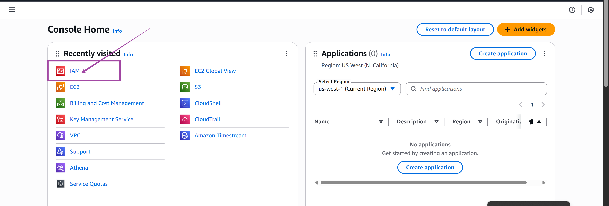
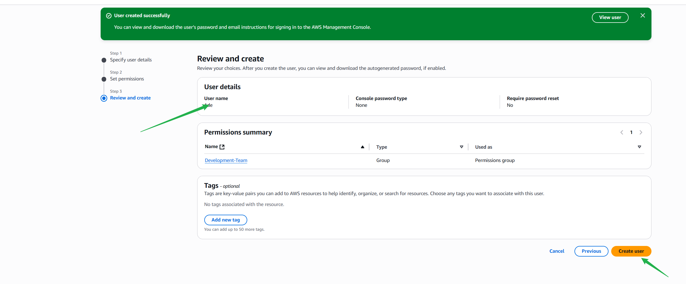
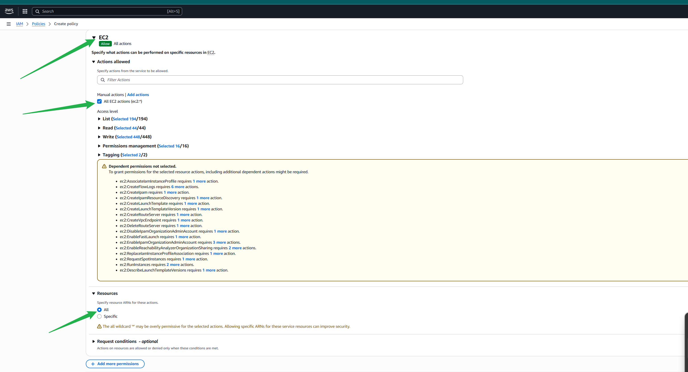

#Hand-on excercises to equip you to set up IAM users, groups, and roles, nhancing real-world IAM implementation skills.

# AWS_IAM_mini_project
more on ow to IAM and Policy on AWS
##Navigate to the aws console, seledct IAM

## select policy and on your top right click create policy

##Check all EC2 actions

## Create policy

##Name and create policy

##Select "attach policy directory" and navigate to filter custom policies
choose the policy you created named 'policy_for_eric'
proceed by clicking on next

Ensure to save for reference 
##Click on return to user list

##Click on Usergroup

##click 'user'

##Add user to group and click next

##Navigate to Policy and "create policy'
Select ec2 all

#Click on nnext to proceed

## Expand to add policy for S3, select 'all'

Click on create policy

##Navigate to 'Users Group' , select the 'Development-team' group

##Proceed to 'permissions' and grant the necessary permission

click on "customer managed" choose the 'Development-team-policy' and attach policy

## You have finally attached the policy successfully without any issue.

